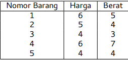

punya gua!

-ilhamz

# Rangkuman Competitive Programming

<a id="rangkuman-competitive-programming"></a>

* [Rangkuman Competitive Programming](#rangkuman-competitive-programming)
  * [Brute Force](#brute-force)
    * [Permutasi](#brute-force-permutasi)
      * [Kombinasi](#brute-force-kombinasi)
  * [Greedy](#greedy)
  * [Dynamic Programming](#dp)
    * [Konsep DP](#konsep-dp)
    * [Contoh Problem DP](#contoh-problem-dynamic-programming)
      * [Longest Increasing Subsequence (LIS)](#lis)
      * [Coin Change](#coin-change)
      * [Path Counting](#path-counting)
      * [0/1 Knapsack Problem](#knapsack-problem)
      * [Longest Common Subsequence (LCS)](#lcs)
  * [Graph](#graph)
    * [Depth-First Searh (DFS)](#dfs)
    * [Breadth-First Search (BFS)](#bfs)
    * [Path Counting pada Graph](#path-counting-graph)

<br>

## Brute Force

<a id="brute-force"></a>

suatu strategi dengan cara **mecoba semua kemungkinan** (complete search). Sehingga pasti menemukan solusi yang diharapkan, tetapi memiliki waktu yang relatif lama.

Contoh persoalan:

> Diberikan sebuah persamaan: p+q+r = 0. Masing-masing dari p, q, dan r harus merupakan anggota dari {a1,a2,...,aN}. Diketahui pula bahwa semua nilai {a1,a2,...,aN}
> unik. Berapa banyak triplet hp,q,ri berbeda yang memenuhi persamaan tersebut?

Solusi Brute Force:
Coba semua kemungkinan dengan menggunakan perulangan sebanyak n (banyaknya variabel). Karena n=3, maka waktu kompleksitasnya $O(n^3)$

- Algoritma dapat doptimasi dengan cara: setelah menentukan nilai p dan q, tentukan nilai r dengan -(p+q). Lalu tentukan apakah nilai r ada di anggota himpunan dengan menggunakan binary search agar lebih cepat. Jika ada maka sudah pasti bernilai 0, jadi simpan hasil dari p+q+r. Waktu kompleksitasnya $O(n^2 log n)$

### > Brute Force Permutasi

<a id="brute-force-permutasi"></a>

Untuk menampilkan semua permutasi bisa menggunakan iterasi biasa, tetapi jumlah iterasi tidak bisa ditentukan, karena mengikuti jumlah data (n). Maka solusinya adalah rekursif:

```cpp
char catat[n];
bool pernah[n];  // all false

void permutation(int depth){
    // base case
    if(depth == n){
          for(int i=0; i<n; i++){    // loop hasil akhir
            cout << catat[i];
        }
        cout << endl;

    } else {
        for(int i=0; i<n; i++){
            // sebelum masuk ke rekursif, cek apakah
            // karakter sudah pernah digunakan. Agar
            // tidak ada digit berulang
            if(!pernah[i]){
                pernah[i] = true;
                catat[depth] = arr[i];  // catat hasil permutasi
                permutation(depth + 1);
                pernah[i] = false;  // reset untuk depth lainnya
            }
        }
    }
}
```

Dimulai dari `permutation(0)`, dari situ akan bercabang sebanyak n, dan seterusnya.

### > Brute Force Kombinasi

<a id="brute-force-kombinasi"></a>

untuk melakukan kombinasi, cukup mengubah perulangan for pada bagian rekursi. Ubah agar perulangan dimulai dari _angka yang dicatat + 1_. Jadi angka sebelumnya tidak akan dicatat lagi. Sehingga _boolean pernah_ tidak perlu dipakai
`i = catat[depth-1] + 1`

## Greedy

<a id="greedy"></a>

suatu strategi dengan **mencari solusi paling optimal hingga ke subproblem**, sehingga memiliki waktu eksekusi yang cepat dan mudah diimplementasikan. 

Greedy dapat dilakukan saat:

- Solusi optimal dapat ditentukan dari subproblem
- Memiliki _Greedy Choice_

**Greedy choice** merupakan langkah yang akan menghasilkan solusi optimal. Contoh: 

> Anda ingin menukar uang Rp12.000 dengan lembaran uang kertas Rp5.000,
> Rp2.000, dan Rp1.000. Anda ingin menukar dengan jumlah lembaran sesedikit
> mungkin.

- Problem: proses penukaran uang (n)
- Subproblemnya: proses penukaran selanjutnya setelah menukar uang ke-n
- Greedy choice-nya: menukar uang dengan nominal sebesar mungkin

Persoalan tersebut dapat dilakukan dengan Greedy karena terdapat subproblem yag juga dapat ditentukan greedy choicenya.

**Kelemahan Greedy**
Tidak semua persoalan dapat diselesaikan dengan Greedy. Sesuai persoalan diatas, jika uang yang tersedia untuk ditukar adalah Rp5.000, Rp4.000, dan Rp1.000 , maka Greedy tidak memberikan solusi optimal

- Solusi Greedy:  Rp5.000, Rp5.000, Rp1.000, Rp1.000
- Solusi optimal:  Rp4.000, Rp4.000, Rp4.000

## Dynamic Programming

<a id="dp"></a>

Mirip dengan brute force tetapi lebih dioptimasi. Masalah yang akan diselesaikan harus memiliki subproblem, lalu akan dicoba satu-persatu.

### Konsep DP

<a id="konsep-dp"></a>

- **_Top-Down_**.
  Metode ini dikerjakan secara rekursif dari problem utama menuju subproblem lainnya. Catat nilai yang sudah dihitung (memoisasi) 

- **_Bottom-Up_**.
  Metode ini dikerjakan secara iteratif dari subproblem menuju problem utama. Hasil perhitungan subproblem akan dicatat didalam array _dp[ ]_.

### Contoh Problem Dynamic Programming:

<a id="contoh-problem-dp"></a>

#### Longest Increasing Subsequence (LIS)

<a id="lis"></a>

> Carilah subsequence angka terpanjang secara ascending dari [3,1,8,2,5] !

::Jawaban: 2::

_Subproblem_: pemilihan angka LIS, dengan LIS[i] = banyaknya LIS dari indeks ke 0 sampai i

Jadi untuk mencari LIS dari awal hingga akhir, maka carilah LIS[4] (terakhir). 


Dengan metode **Bottom Up**, LIS[i] dapat diselesaikan dengan cara mencari nilai maksimal dari setiap LIS sebelumnya, lalu ditambah satu untuk menghitung LIS ke i sendiri

```cpp
LIS[i] = max(LIS[0], LIS[1], ..., LIS[n]) + 1
```

**Algoritma Penyelesaian :**

1. Gunakan outer loop untuk mengisi LIS[i] dari 1 hingga n, sekaligus menjalankan nilai arr[i] untuk dibandingkan
2. Gunakan inner loop untuk cek setiap LIS sebelum i
3. Jika `arr[i] > arr[j]` maka LIS[i] **ditambah satu**, karena arr[j] juga termasuk Increasing Subsequence. Jika tidak maka biarkan.
4. Simpan nilai kedalam LIS[i]

```cpp
int dp[n];  // array LIS dengan nilai awal 0
int ans = 0  // untuk mencari Longest

dp[0] = 0;   // base case

for(int i=1; i<n; i++){
  int maxx = 0;
  for(int j=0; j<i; j++){
    if(arr[i] > arr[j]){
      maxx = max(dp[j] + 1, dp[i]);
    } else {
      maxx = max(dp[j], dp[i]);
    }
  } 
  dp[i] = maxx;
  // untuk mendapatkan Longest, simpan nilai LIS max
  ans = max(ans, dp[i])
}
```

#### Coin Change

<a id="coin-change"></a>

> Diberikan 3 jenis koin yaitu [1,6,10] yang jumlahnya tak terbatas. Tentukan banyaknya koin minimal yang bisa ditukar dengan $12$ rupiah

::Jawaban: 2::

- _Subproblem:_ $dp[i]$ adalah penukaran uang sebanyak $n-dp[j]$
- _Base Case_: saat uang bernilai 0, maka tidak ada koin yang ditukar (return 0)

```cpp
int dp[n+1];
dp[0] = 0;

for(int i=1; i<=n; i++){
    int minn = 1e5;
    for(int j=0; j<m; j++){
        if(i >= coin[j]){
            minn = min(minn, dp[i-coin[j]] + 1);
        }
    }
    dp[i] = minn;
}
```

**Selengkapnya ada di Buku TOKI Competitive Programming**

#### Path Counting

<a id="path-counting"></a>

> Hitunglah total jalur dari _start_ menuju _end_, jika gerakan yang diperbolehkan hanya ke bawah dan ke kanan

::Jawaban: 2::


- _Subproblem:_ dp[i][j] adalah banyak jalur yang bisa ditempuh dari start ke petak [i][j]
- _Base case:_ jumlah jalur pada titik start adalah 1 (return 1)

Dengan metode **Bottom Up**, gunakan dp[r][c] untuk mencatat subproblem. Semua petak yang belum dicek bernilai 0 pada tabel dp. Tabel dp[i][j] dapat ditentukan dengan backtracking, yaitu menjumlahkan semua jalur yang ada dipetak kiri dan atas.

```cpp
if(dp[i-1][j] not out of bounds) dp[i][j] += dp[i-1][j]
if(dp[i][j-1] not out of bounds) dp[i][j] += dp[i][j-1]
```

**Algoritma Penyelesaian :**

1. Gunakan outer loop dan inner loop untuk mengisi dp[i][j]
2. Counter problem saat cek data out of bounds

```cpp
// isi semua dp dengan 0

dp[0][0] = 1;
for(int i=0; i<n; i++){
    for(int j=0; j<n; j++){
         // asumsikan jalur yang tersedia adalah bernilai 1
        if(path[i][j] == 1 && (i>0 || j>0)){
            if(i-1 >= 0 && path[i-1][j] != 0) dp[i][j] += dp[i-1][j];
            if(j-1 >= 0 && path[i][j-1] != 0) dp[i][j] += dp[i][j-1];
        }
    }
}

cout << dp[n-1][n-1];
```

#### 0/1 Knapsack Problem

<a id="knapsack-problem"></a>

> Diberikan N buah barang. Barang ke-i memiliki harga vi rupiah dan berat wi gram. Kita memiliki tas yang berkapasitas C gram. Kita ingin
> memasukkan beberapa barang ke dalam tas, sehingga dihasilkan harga sebanyak mungkin!



::Jawaban: 15::

Untuk menyelesaikannya dibutuhkan $dp[i][c]$. Dimana $i$ menyatakan jumlah barang yang tersedia dari barang ke-1 sampai i. Dan $j$ menyatakan kapasitas tas dimulai dari 0

Terdapat 2 pilihan, yaitu **ambil** barang atau **tidak**. Saat barang diambil maka $i$ akan berkurang 1 dan mendapatkan harga barang tersebut. Saat barang tidak diambil, maka $i$ juga berkurang 1 karena barang diskip. Tetapi tidak mendapatkan harga. Dapat dituliskan sebagai berikut:

```cpp
ambil = dp[i-1][c - wi] + vi
notAmbil = dp[i-1][c]
```

- _Subproblem:_ $dp[i][j]$ adalah harga maksimal saat tersedia barang 1 sampai i, dan kapasitas tas sebanyak j gram
- _Base case:_ Saat kapasitas tas 0 gram, maka tidak ada barang yang bisa dimasukkan (return 0)

**Algoritma penyelesaian:**

1. Isi semua $dp[i][0]$ dengan 0 sebagai base case.
2. Gunakan outer loop untuk mengisi $i$ sebagai banyak barang yang akan dicek, dan inner loop untuk mengisi $j$ dimulai dari 1 sampai tepat $c$
3. Counter problem saat $i-1 < 0$ karena akan out of bounds.

```cpp
int dp[n][c+1];
for(int i=0; i<n; i++) dp[i][0] = 0;  // base case

for(int i=0; i<n; i++){
    int ambil=0, notAmbil=0;
    for(int j=1; j<=c; j++){

        // counter problem saat i = 0
        if(i == 0){
            if(j >= pr[i].second){    // ambil
                dp[i][j] = pr[i].first;
            } else {    // tidak ambil
                dp[i][j] = 0;
            }

        } else {
            if(j >= pr[i].second){
                ambil = dp[i-1][j-pr[i].second] + pr[i].first;
            }
            notAmbil = dp[i-1][j];
            dp[i][j] = max(ambil, notAmbil);
        }
    }
}

cout << dp[n-1][c+1-1];
```

#### Longest Common Subsequence (LCS)

<a id="lcs"></a>

> Diberikan 2 buah string A dan B. Panjang kedua string tidak harus sama. Berapa
> panjang string terpanjang yang merupakan subsequence dari A dan B? <br> A = "ajaib" <br> B = "badai"

::Jawaban: 3 (aai)::

Gunakan konsep _character cutoff_ mulai dari subproblem terkecil, yaitu saat hanyan tersedia 1 character pada masing-masing string (A="a", B="b"). Lalu meningkat sampai tersedia semua karakter.

Gunakan $dp[i][j]$, dimana $i$ merupakan jumlah karakter yang tersedia untuk A dari indeks 0 sampai $i$. Dan begitu juga $j$ untuk B.

Terdapat 2 kondisi, yaitu ketika karakter sama dan tidak sama.

- Jika $A[i] == B[j]$, maka LCS ditambah 1. Karena karakter sama, maka kita dapat melanjutkan cek ke karakter sebelumnya (backtracking).
- Jika $A[i] ≠  B[j]$, maka coba cek $A[i]$ dengan $B[j-1]$ dan $B[j]$ dengan $A[i-1]$ _(character cutoff)_. Dan cari LCS maksimalnya.

```cpp
if(A[i] == B[i]){
  dp[i][j] = dp[i-1][j-1] + 1;
} else{
  cutA = dp[i-1][j];
  cutB = dp[i][j-1];
  dp[i][j] = max(cutA, cutB);
}
```

- _Subproblem:_ $dp[i][j]$ adalah LCS saat A hanya tersedia karakter 0 sampai $i$. Dan B hanya tersedia karkter 0 sampai $j$
- _Basecase:_ Saat $i=0$ atau $j=0$ maka tidak bisa mendapatkan subsequence, karena tidak ada karakter. (return 0)

```cpp
    string a = "ajaib";
    string b = "badai";
    int m = a.length();
    int n = b.length();

    int dp[m+1][n+1];
     for(int i=0; i<=m; i++) dp[i][0] = 0;  //basecase
    for(int i=0; i<=n; i++) dp[0][i] = 0;  //basecase

    for(int i=1; i<=m; i++){
        for(int j=1; j<=n; j++){
            if(a[i-1] == b[j-1]){  // -1 karena cek indeks dari 0
                dp[i][j] = dp[i-1][j-1] + 1;
            } else {
                int cutA = dp[i][j-1]; 
                int cutB = dp[i-1][j];
                dp[i][j] = max(cutA, cutB);
            }
        }
    }
```

## Graph

<a id="graph"></a>

### Representasi Graph

- **Adjenct List**
  
  Masing-masing node disimpan dalam array. Setiap index array menyimpan vector berisi node yang terhubung
  
  ```cpp
  // untuk graf tidak berbobot
  vector<int> adj[N];
  adj[1].push_back(3); //node1 ke node3
  adj[2].push_back(1);
  adj[4].push_back(2); 
  
  // untuk graf berbobot
  vector<pair<int,int>> adj[N];
  adj[1].push_back({4,5});
  adj[2].push_back({2,1});
  adj[4].push_back({4,2});
  ```

- **Adjency Matix**
  Baris untuk node, dan kolom untuk node tujuan. Value matriks berisi nilai boolean yang menandakan node terhubung atau tidak
  
  ```cpp
  int adj[N][N];
  adj[1][2] = 1;
  adj[3][1] = 1;
  ```

- **Edge List**
  
  Node yang terhubung disimpan didalam vector, tanpa berpatokan indeks.
  
  ```cpp
  vector<int> adj;
  adj.push_back({2,3})
  adj.push_back({1,2})
  ```

### DFS (Depth-First Search)

<a id="dfs"></a>

Adalah konsep traversal pada graph yang **memprioritaskan node paling dalam terlebih dahulu**. Langkah yang dilakukan dalam penelusuran DFS:

1. Push node awal kedalam stack
2. Telusuri tetangga node yang belum dikunjungi, lalu push kedalam stack. Node yang masuk akan menjadi prioritas, sehingga node pada stack sebelumnya harus menunggu dulu. **(prioritaskan node terdalam)**
3. Sekaligus tandai node yang masuk kedalam stack sebagai node yang sudah dikunjungi
4. Ulangi sampai semua node terkunjungi

```cpp
    stack<int> st;    // simpan node yang belum dikunjungi
    bool visited[n+1];    // sudah/belum dikunjungi

    // fill
    fill(visited, visited+n+1, false);

    st.push(1);
    visited[1] = true;
    while(!st.empty()){
        int current = st.top();
        st.pop();
        cout << "node-" << current;

        for(int i=1; i<=n; i++){    // cari semua node tetangga yg belum dikujungi
            if(jalur[current][i] && !visited[i]){
                st.push(i);
                visited[i] = true;    // setelah ditemukan, langsung tandai
            }
        }    
    }    
```

### BFS (Breadth-First Search)

<a id="bfs"></a>

Konsep traversal pada graph yang **memprioritaskan node terdekat**. Langkah yang dilakukan dalam penelusuran BFS:

1. Push node awal kedalam queue
2. Telusuri tetangga node yang belum dikunjungi, lalu push kedalam queue. Node tersebut akan dikunjungi setelah semua node sebelumnya terkunjungi
3. Sekaligus tandai node yang masuk kedalam queue sebagai node yang sudah dikunjungi
4. Ulangi sampai semua node terkunjungi

```cpp
    queue<int> q;
    bool visited[n+1];

    fill(visited, visited+n+1, false);

    q.push(1);
    visited[1] = true;
    while(!q.empty()){
        int current = q.front();
        q.pop();
        cout << "node-" << current;

        for(int i=1; i<=n; i++){
            if(jalur[current][i] && !visited[i]){
                q.push(i);
                visited[i] = true;
            }
        }
    }
```

### Path Counting pada Graph

<a id="path-counting-graph"></a>

Tambahkan array baru untuk menyimpan jarak pada suatu node ke node lainnya. Isi array tersebut saat proses push dengan nilai `jarak[node] = jarak[current] + 1`.

Menggunakan *adjacency list*:

```cpp
for(int i: adj[current]){
    if(!visited[i]){
        st.push(i);
        visited[i] = true;
        dist[i] = dist[current] + 1;
    }
}
```

### Component Count


Untuk menghitung berapa komponen pada graf, kita harus memulai traversal dari node pada masing-masing komponen

1. Perulangan dimulai dari $visited[]$ node pertama sampai akhir. Jika belum dikunjungi maka push kedalam stack sebagai start node dari suatu komponen

2. Traversal akan berjalan sambil mencatat node yang dikunjungi dari komponen tersebut

3. Saat semua node terkunjungi, lanjut cek $visited[]$ untuk cek apakah ada komponen yang belum di traversal

4. Jika ada lakukan traversal dari node tersebut sebagai  start node

---

# Rangkuman C++

## For Your Information

### Print Variable type

```cpp
cout << typeid(var).id();
```

### Prototype function

Deklarasi fungsi disetelah main dapat dilakukan dengan cara membuat prototype:

```cpp
void solve(int a, int b);
int main(){
    ...
}
void solve(int a, int b){
    ...
}
```

### Get single line input

```cpp
getline(cin, input);
```

### _goto_ Function

Go to the spesific flag

```cpp
flagName:
  print("go to here");

goto flagName;
```

### Determine its decimal or not

```cpp
#include <cmath>
if(i/3 == floor(i/3)) isDecimal = false;
```

### Determine its a perfect square

```cpp
temp = round(sqrt(i));
if(temp*temp == i) isPerfect = true;
```

### Sort pair based on second (boolean)

```cpp
bool sort_second(pair<int, int> &a, pair<int, int> &b){
    return a.second < b.second;
}

vector<pair<int,int>> pr;
sort(pr.begin(), pr.end(), sort_second);
```

### Return array function with pointer

```cpp
int * generate(int arr[], int size){
    for(int i=0; i<size; i++){
        arr[i] = i+1;
    }
    return arr;
}

int main(){
    int *arr = generate();
}
```

## Data Structure Type

### Map

menyimpan data menurut key dan value nya.

```cpp
map<string, int> mp;
mp["john"] = 98;
mp["marko"] = 72;

// loop with iterator
// first for the key, second for the value
for(auto it=mp.begin(); it!=mp.end(); it++){
    cout << it->first << " " << it->second << endl;
}
```

--- 

## Algorithm

### Binary search

Pengurutan seperti halnya mencari kata didalam kamus. 
Time complexity: $O(log n)$

```cpp
mid = 0;
ans = 0;
left = 0;
right = arr.length()-1;

while(left<=right and ans==0){
    mid = (left+right) / 2;
    if(search<arr[mid]) right = mid-1;
    else if(search>arr[mid]) left = mid+1;
    else ans = arr[mid];
}
```

### Sorting with Parameter Function

```cpp
bool sc(int a, int b){
    if(a%b != 0) return true;
    else return false;

int main(){
    sort(arr, arr+n, sc);
}
```

### Print all substring

use s.substr(start, substring length);

```cpp
for(int i=0; i<s.length(); i++){
        for(int j=1; j<=s.length()-i; j++){
            cout << s.substr(i,j) << endl;
        }
    }
```

### Maximum subarray sum

Basically, it needs 2 iteration. Time complexity: $O(n^2)$

```cpp
int ans = 0;
for(int i=0; i<n; i++){
  int sum = 0
  for(int j=i; j<n; j++){
    sum += arr[j];
    ans = max(ans, sum);
  }
}
```

Algorithm with single iteration. Time complexity: $O(n)$

```cpp
int best = 0, sum = 0;
for(int i=0; i<n; i++){
  sum = max(arr[i], sum+arr[i]);
  ans = max(ans, sum);
}
```

### Prefix Sum

Sebuah array yang berisi total setiap elemen array, yang dihitung satu persatu. Contoh [3,4,2,5], prefix-sumnya adalah [3,7,9,14]

```cpp
int ps[n];
ps[0] = arr[0];  //nilai pertama
for(int i=1; i<n; i++){
  ps[i] = arr[i] + ps[i-1];
}
```

Atau gunakan fungsi dari STL:numeric partial_sum

```cpp
int arr[] = {1,2,3}, ps[n];
partial_sum(arr, arr+n, ps[n]) //hasil akan disimpan di array ps
```

Untuk mengakses jumlah subarray $l$ sampai $r$, gunakan perhitungan:

```cpp
int subarray = ps[r] - ps[l-1]
```

## STRING

### Uppercase and lowercase

```cpp
//to check
isupper(c)
islower(c)
//to convert
toupper(c)
tolower(c)
```

### Convert string <-> integer

```cpp
stoi(s);  // string to integer
to_string(i);  // integer to string
```

### Erase a character from string

```cpp
s.erase();      // erase all
s.erase(2);     // erase from index 2 
s.erase(2, 4);  // earse from index 2, up to 4 character
```

## ARRAY

### Array summary

```cpp
accumulate(arr, arr+arrLength, sum)
```

### Fill array

```cpp
#include <cstring>
memset(arr, 0, sizeof(arr))  //set the memory
fill()
```

### Sort array ascending/descending

```cpp
#include <algorithm>
sort(arr, arr+n); //ascending
sort(arr, arr+n, greater<int>()); //descending
sort(arr, arr+n, greater<double,int>()); //descending (pair)
```

### How many element types in array

```cpp
int count = 0;
bool isUnique = true

for(int i=0; i<n; i++){
    for(int j=i+1; j<n; j++){
        if(arr[i] == arr[j]){
            isUnique = false;  //same element detected
            break;
    }

    if(isUnique) count++;
}
```

### Find an element in array

```cpp
if(find(begin(arr), end(arr), "a") != end(arr)){
  // Element found
}
```

### Check all of the array element

```cpp
#include <algorithm>
if(all_of(begin(arr), end(arr), [](bool b){return b==true};)){
    isAllTrue = true;
}
```

### Permutation

```cpp
#include <algorithm>
next_permutation(begin(arr), end(arr));
```

## VECTOR

### Function

```cpp
// initialize with size and value 
vector<int> vt(10, 0);  // size=10; element=0

// get vector size
int n = vt.size();

// modify element
vt.push_back()  //add element
vt.pop_back()   //remove last element
vt.insert(vt.begin() + (indexTarget) , value)   //insert at index
vt.clear()   //erase all element
vt.erase(vt.begin + (indexTarget))   //erase at index
vt.empty()   //check empty
```

## FUNCTION

### Reverse number

```cpp
rev = 0
while(num>0){
    rev = (rev*10) + (num%10);
    num /= 10;
}
```

### Prime number

```cpp
int n; //angka yang dicek
bool isPrime = true;

for(int i=2; i*i<=n; i++){
    if(n%i == 0){
        isPrime = false;
        break;
    }
}

if(isPrime) cout << "Prime";
else cout << "Not Prime";
```

### GCD with Euclid Method

```cpp
int euclid(int a, int b){
    if(b==0) return a;
        else return euclid(b, a%b);
}
```
